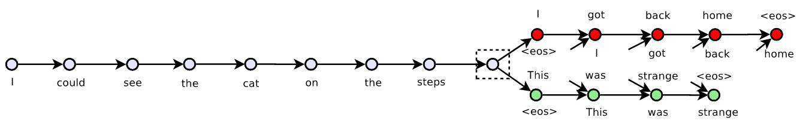
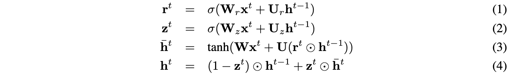
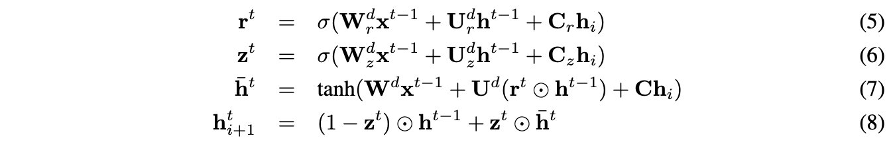
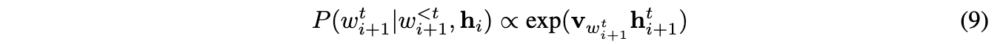
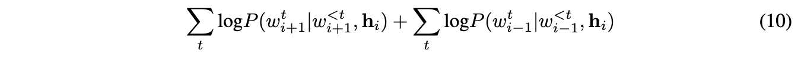

![www.bakinglyrics.com][logo]

[logo]: img/logo.png "Baking Lyrics logo" 

This is an open source, side project created from the bottom of the world. (Bottom to be read as arse). Here is a map.
But is for everyone. Our humble contribution to those who make our lives wonderful freeing us from our own thoughts (for just a few minutes)

We wish you the best so play as much as you want, release your creativity, innovate,  copy & paste.

Best regards,
The Baking-Lyrics coding band.

[www.bakinglyrics.com](http://www.bakinglyrics.com)

___

# Intro

Baking-Lyrics works based on a group of Machine and Deep learning models that generates music lyrics and titles automatically.
Currently available in English (soon Spanish as well).

Baking Lyrics was developed by a team of music; machine learning and software development enthusiasts all the way from Buenos Aires, Argentina. Our country is well know for its rock scene so we were tempted on using a 100% rock corpus but our metal loving friends convinced us of accepting other genres. 

## Baking Lyrics: An automatic lyrics generator

Be a rock star using machine learning to generate lyrics!
Baking lyrics is an automatic generator of lyrics based on a natural language model that is trained using the largest database of lyrics online.
The vast corpus contains all the lyrics of the most popular bands and singers of our time. This corpus was used to train a language model that reproduces the style of each band or singer. If you ever wanted to reproduce the talent of your favorite songwriter, now is the time!

# How-to

- Clone the repo.
- Create a python venv in your SO
- Source it: `source bar/foo/venv/your-venv/bin/activate`
- Run `pip install -r requirements/dev.txt`
- Request the current models to [Andrei Rukavina](mailto:rukavina.andrei@gmailcom)
- Request the songsdata.csv to [Andrei Rukavina](mailto:rukavina.andrei@gmailcom)
- Put the file under: `/api/resources/models/` and `/api/resources/` respectively 
- Add the following ENV variable into your favourite OS: `APP_CONFIG_FILE=/Users/<your name>/GitHub/Baking-Lyrics/config/development.py`
- Add the following ENV variable into your favourite OS: `PYTHONPATH=/Users/arukavina/github/baking-lyrics`
- Run `cd /api`
- Run `refresh_database.py` 
- Run `manage.py run`

# Models

While developing the app we tried many different models and approaches.

## Deep-Learning models

Text summarization is a problem in natural language processing of creating a short, accurate, and fluent summary of a source document.

The Encoder-Decoder recurrent neural network architecture developed for machine translation has proven effective when applied to the problem of text summarization.

It can be difficult to apply this architecture in the Keras deep learning library, given some of the flexibility sacrificed to make the library clean, simple, and easy to use.

# Skip-Thought Vectors

From [arXiv:1506.06726v1](https://arxiv.org/pdf/1506.06726.pdf) (June 22nd 2015)
By: Ryan Kiros, Yukun Zhu, et. al.

_This is Baking-Lyrics current model_

The authors considered the following question: 
'is there a task and a corresponding loss that will allow us to learn highly generic sentence representations?' 

they gave evidence for this by proposing a model for learning high-quality sentence vectors without a particular supervised task in mind. Using word vector learning as inspiration, they proposed an objective function that abstracts the skip-gram model of [8] to the sentence level.  
That is, instead of using a word to predict its surrounding context, they instead encode a sentence to predict the sentences around it.  
Thus, any composition operator can be substituted as a sentence *encoder* and only the objective function becomes modified. 

The following figure illustrates the model:

They called their model: *skip-thoughts* and vectors induced by our model are called *skip-thought vectors.*

### Encoder-Decoder

*Encoder*. Let w1i,...,wNi be the words in sentences i where N is the number of words in the sentence. 
At each time step, the encoder produces a hidden state ht/i which can be interpreted as the representation of the sequence
w1i,...,wti. 
The hidden state hNi thus represents the full sentence. To encode a sentence, we iterate the following sequence of equations (dropping the subscript i):

where  ̄ht is the proposed state update at time-t,z-t is the update gate,rt is the reset gate () denotes a component-wise product. 
oth update gates takes values between zero and one.Decoder.

*The decoder* is a neural language model which conditions on the encoder output hi. 
The computation is similar to that of the encoder except we introduce matrices Cz,Cr and C that are used to bias the update gate, 
reset gate and hidden state computation by the sentence vector.  One decoder is used for the next sentences i+1 while a second decoder is used for the previous sentences i−1. 
Separate parameters are used for each decoder with the exception of the vocabulary matrixV, which is the weight matrix connecting the decoder’s hidden state for computing a distribution over words. 

In what follows we describe the decoder for the next sentences i+1 although an analogous computation is used for the previous sentences i−1. 
Let hti+1 denote the hidden state of the decoder at time-t. Decoding involves iterating through the following sequence of equations (dropping the subscript i+ 1):

Givenhti+1, the probability of wordwti+1given the previoust−1words and the encoder vector is

where v w,t i+1 denotes the row ofV corresponding to the word of w t i+1.  An analogous computation is performed for the previous sentences i−1.

Objective. Given a tuple (si−1,si,si+1), the objective optimized is the sum of the log-probabilities for the forward and backward sentences conditioned on the encoder representation

## Encoder-Decoder Architecture

*Based on: [machinelearningmastery.com](https://machinelearningmastery.com/encoder-decoder-models-text-summarization-keras/)*

The Encoder-Decoder architecture is a way of organizing recurrent neural networks for sequence prediction problems that have a variable number of inputs, outputs, or both inputs and outputs.

The architecture involves two components: an encoder and a decoder.

* Encoder: The encoder reads the entire input sequence and encodes it into an internal representation, often a fixed-length vector called the context vector.
* Decoder: The decoder reads the encoded input sequence from the encoder and generates the output sequence.

For more about the Encoder-Decoder architecture, see the post:

* Encoder-Decoder Long Short-Term Memory Networks

Both the encoder and the decoder submodels are trained jointly, meaning at the same time.

This is quite a feat as traditionally, challenging natural language problems required the development of separate models that were later strung into a pipeline, allowing error to accumulate during the sequence generation process.

The entire encoded input is used as context for generating each step in the output. Although this works, the fixed-length encoding of the input limits the length of output sequences that can be generated.

An extension of the Encoder-Decoder architecture is to provide a more expressive form of the encoded input sequence and allow the decoder to learn where to pay attention to the encoded input when generating each step of the output sequence.

This extension of the architecture is called attention.
The Encoder-Decoder architecture with attention is popular for a suite of natural language processing problems that generate variable length output sequences, such as text summarization.
The application of architecture to text summarization is as follows:

* Encoder: The encoder is responsible for reading the source document and encoding it to an internal representation.
* Decoder: The decoder is a language model responsible for generating each word in the output summary using the encoded representation of the source document.

## N-Gram models

N-gram models are probabilistic models that assign probabilities on the “next” word in a sequence, given the n-1 previous words. This algorithm takes in an array of Strings (the songs in our corpus), and uses punctuation to select beginning and end tokens on each sentence.
Baking lyrics uses a trigram model, since it calculates the frecuencies in which every three-word combination appear on each band's corpus, and extrapolates the probabilities from there.

# FAQ
_There is always something that breaks_

## TensorFlow

If needed, different wheels (*.whl) for TF could be found here: [TensorFlow](https://www.tensorflow.org/install/pip). Use it to upgrade the [requirements file](requirements/dev.txt) accordingly. 

##Environment Variables

### If using **flask run**
`flask run`
1) PROD: PYTHONUNBUFFERED=1;FLASK_APP=baking.main:create_app(r'config/production.py');FLASK_ENV=production;FLASK_RUN_PORT=8003
2) TEST: PYTHONUNBUFFERED=1;FLASK_APP=baking.main:create_app(r'config/testing.py');FLASK_ENV=testing;FLASK_RUN_PORT=8001
3) DEV:PYTHONUNBUFFERED=1;FLASK_APP=baking.main:create_app(r'config/development.py');FLASK_RUN_PORT=8000;FLASK_DEBUG=0;FLASK_ENV=development. 
Feel free to enable debug mode in DEV
 
### If using **manage run**
`python manage.py run`
1) TEST: PYTHONUNBUFFERED=1;APP_CONFIG_FILE=config/testing.py
2) DEV: PYTHONUNBUFFERED=1;APP_CONFIG_FILE=config/development.py 
Feel free to enable debug mode in DEV

### To run Tests: 
`python manage.py test`

* PYTHONUNBUFFERED=1;APP_CONFIG_FILE=config/testing.py
